# Wafer Inspection — Beckhoff Vision Code Analysis

**Scope:** vision analysis code only (no HMI). Based on the Nestlé Vanguard TwinCAT project developed by Beckhoff UK (Chris Knight), recovered from `Nestle_Base.library` v0.0.0.6 and `Vanguard_Wafer_Inspection.library` v0.0.0.11, plus the application project `Vanguard_Vision_Inspection`.

**Cross-references:**
- York/Peacock manual: `documents/PHASE_1/PHASE_1 - Manual Documents/Confectionary Quality Control System Manual v1.0.pdf`
- Nestlé URS: `documents/PHASE_1/PHASE_1 - Manual Documents/URS Bar Rejection Vision System R7_Software devlopment.pdf`
- Faclon delta sheet: `documents/PHASE_1/Faclon_Now_to_W1_WBS.xlsx` (sheet `F.2 vision deltas`)

---

## 1. Why the code is split into two sections in TwinCAT

When you open the project you see two distinct areas in the Solution Explorer:

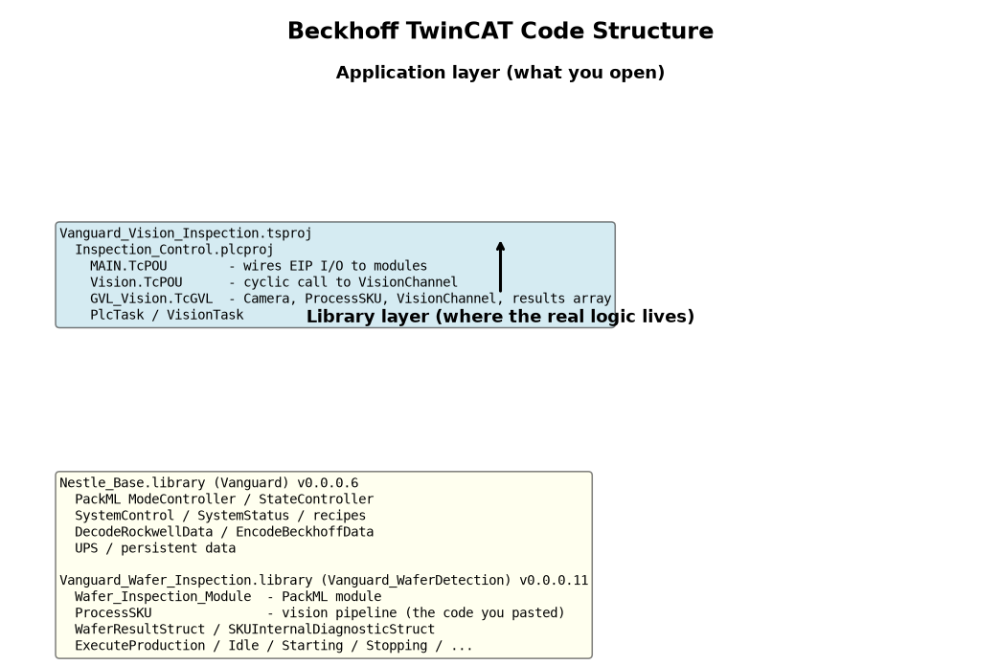

| Section | What it is | Why it exists |
|---|---|---|
| **Application** — `Vanguard_Vision_Inspection` (SYSTEM + `Inspection_Control` PLC project) | The runnable project. Contains `MAIN`, `Vision`, `GVL_Vision`, task configuration, and the `_Config` for the target IPC. | Thin "wiring" layer. It instantiates library function blocks, maps them to EtherNet/IP I/O, and assigns them to PLC/Vision tasks. |
| **Libraries** — `Vanguard` (Nestle_Base) and `Vanguard_WaferDetection` (Vanguard_Wafer_Inspection) | Compiled, versioned TwinCAT libraries (`.library`). | The real logic lives here: PackML state/mode control, recipes, `ProcessSKU` vision pipeline, `Wafer_Inspection_Module`, and EIP encode/decode. Libraries let Nestlé reuse the same code across Vanguard projects without copying source. |

**Practical consequence:** you can read `MAIN.TcPOU` and `GVL_Vision.TcGVL` directly, but to see or change the inspection algorithm you must either open the library source project (if available) or treat the `.library` as a black box and patch behaviour via recipes/parameters.

### 1.0.1 Library Pyramid Structure (from Beckhoff Handover, Aug 13)

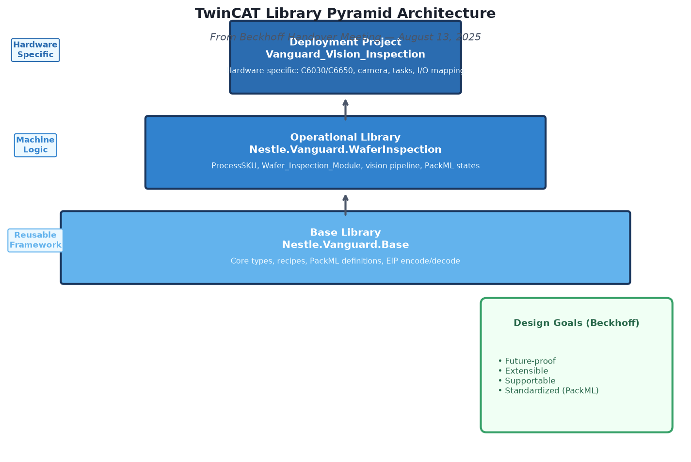

Chris Knight (Beckhoff UK) explained the architecture as a **pyramid** designed for Nestlé reusability:

| Layer | Library / Project | Contents | Purpose |
|---|---|---|---|
| **Base** | `Nestle.Vanguard.Base` (Nestle_Base.library) | Core types, recipes, PackML state definitions, EtherNet/IP encode/decode | Shared across all Nestlé Vanguard machines. No machine-specific logic. |
| **Operational** | `Nestle.Vanguard.WaferInspection` (Vanguard_Wafer_Inspection.library) | `ProcessSKU`, `Wafer_Inspection_Module`, vision pipeline, state machine | Wafer-specific inspection logic. Consumes base types. |
| **Deployment** | `Vanguard_Vision_Inspection` (this project) | `MAIN`, `Vision`, `GVL_Vision`, task config, hardware mapping | Hardware-specific wiring. Deploys to C6030/C6650 IPC. |

**Rationale:** Nestlé can swap the operational library (e.g., future Surface Inspection) without rewriting the base or deployment layers. The deployment project is the only layer that changes per machine.

---

## 1.1 Why a METHOD editor is also split into two panes (Declaration vs Implementation)

The screenshot of `ProcessSKU.Process` is a **different** two-section split from the Solution Explorer. TwinCAT XAE (CODESYS-based, IEC 61131-3) opens every POU and METHOD as a **vertically split editor**:

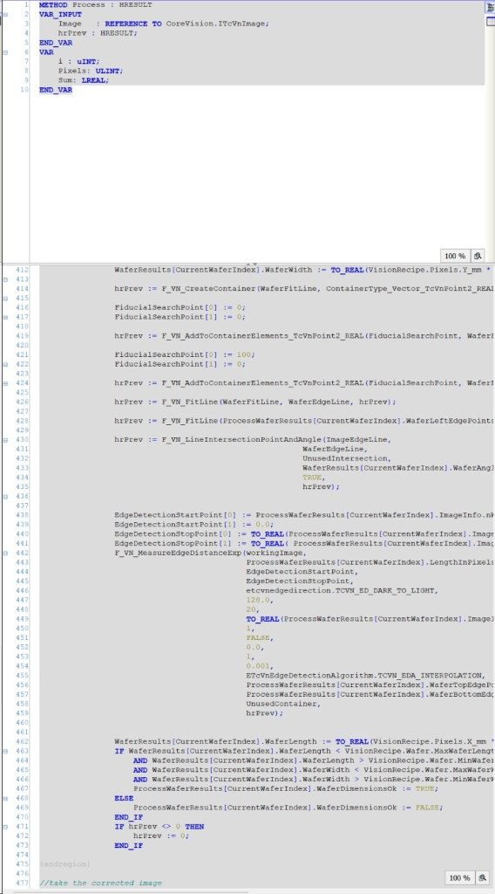

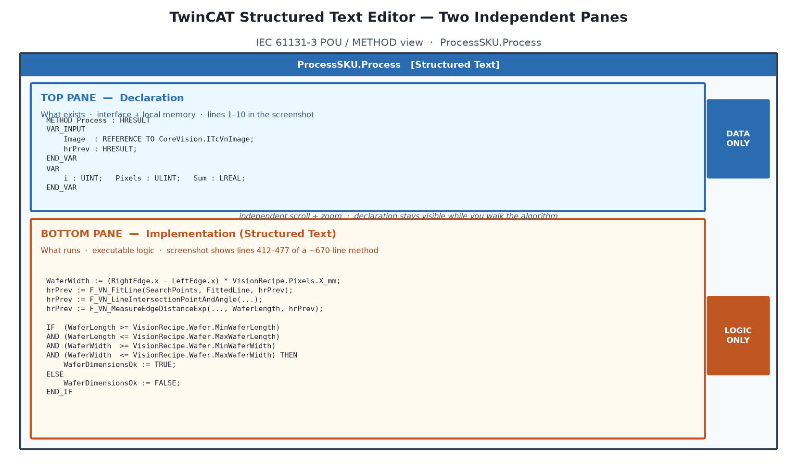

| Pane | What it is | What you see in `Process` |
|---|---|---|
| **Top — Declaration** | Interface and memory only. No executable statements. Own scroll bar and zoom. | `METHOD Process : HRESULT`, `VAR_INPUT` (`Image`, `hrPrev`), and local `VAR` (`i`, `Pixels`, `Sum`). Lines 1–10. |
| **Bottom — Implementation** | Executable Structured Text only. Own scroll bar and zoom. | The wafer algorithm. The screenshot is scrolled to lines 412–477: edge fit (`F_VN_FitLine`), intersection, `F_VN_MeasureEdgeDistanceExp`, then the `WaferDimensionsOk` min/max check. |

**Why Beckhoff does this (not a project bug):**

1. **IEC 61131-3 rule.** A POU is defined as *declaration + body*. TwinCAT stores them as separate XML nodes in the `.TcPOU` file (`<Declaration>` and `<Implementation><ST>`). The editor mirrors that file format.
2. **You can keep the variable list visible** while scrolling a 600+ line method. That is why the top pane stays on lines 1–10 while the bottom pane is at line 412.
3. **The compiler type-checks the declaration first.** Inputs, outputs, and locals must exist before any ST line can use them. Putting `VAR` blocks in the implementation pane is illegal.
4. **Same split for every language.** Ladder, FBD, and ST all share the declaration pane. Only the bottom pane changes language.

**How to read `Process` in TwinCAT:**

- Top pane = “what this method is allowed to see”: the incoming 16-bit height map (`Image`) and the chained vision HRESULT (`hrPrev`).
- Bottom pane = “what it does with that image”: calibration, filters, fiducials, per-cavity measurements, pass/fail, cleanup.
- Function-block instance variables (`VisionRecipe`, image buffers, timers) live on `ProcessSKU` itself, not in the method declaration. The method only declares what is local to this call.

This is **not** the Application vs Libraries split in section 1. Both splits appear in the same TwinCAT window: Solution Explorer on the left, then this two-pane editor when you open `Process`.

---

## 1.5 Physical Line Integration & Fitment Architecture (0.0m to 25.0m)

Understanding where this code fits into the physical factory environment is essential. The inspection and rejection hardware spans a **25-meter conveyor timeline** on Moulding Line 3 at Nestlé Ponda.

### 1.5.1 Line Overview & 25m Timeline

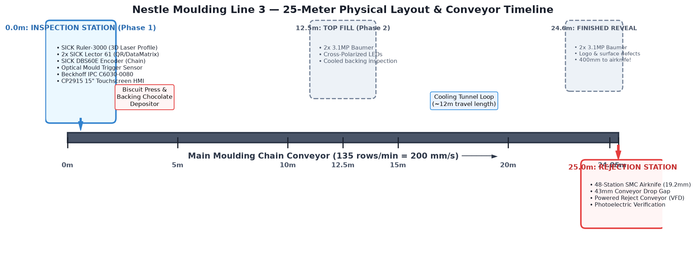

At standard production speed (135 rows/min or 2.25 rows/s for KitKat 2F Mini with an 88.89 mm row pitch), the chain conveyor advances at **200 mm/s**.

| Station & Location | Hardware Installed | Operational Purpose |
|---|---|---|
| **0.0m Mark: Inspection Station** (Phase 1) | SICK Ruler-3000 3D Laser Profile Camera (`V3DU3-120RM25A`), 2x SICK Lector 61 2D DataMatrix code readers, IFM `O6T215` optical leading edge trigger, SICK `DBS60E` rotary encoder. Beckhoff IPC C6030-0080 + CP2915 15" Touchscreen HMI. | Triggered as mould enters station. Acquires 16-bit 3D height profile across the 922 mm mould cavity width. Runs `ProcessSKU.Process` on Beckhoff IPC to verify wafer placement, thickness, and alignment before chocolate backing. |
| **0.0m to 24.6m: Process Loop** | Biscuit press, backing chocolate depositor, and cooling tunnel loop (~12m travel length). | Mould travels along chain while chocolate solidifies. Mould identity tracked via side DataMatrix codes and encoder pulses. |
| **12.5m Mark: Top Surface Reveal** (Phase 2 future) | 2x 3.1MP Baumer VCXG cameras + cross-polarized LED bar lights. | Inspects cooled backing chocolate layer while still inside mould pockets. |
| **24.6m Mark: Finished Surface Reveal** (Phase 2 future) | 2x 3.1MP Baumer VCXG cameras + cross-polarized lighting. | Inspects finished top chocolate surface and logo post-demoulding. Exactly 400 mm (2.0 seconds) ahead of airknife. |
| **25.0m Mark: Rejection Station** | 48-station SMC Solenoid Valve Manifold (`SS5Y5` series + fast `SY5A00` valves, 19.2 mm pitch) with `KN-R01-150` nozzles, 43 mm conveyor drop gap, Cobalt `C0B-040-ST` powered reject conveyor driven by Allen-Bradley PowerFlex 525 VFD, Omron `E3Z-R81` photoelectric drop sensor. | Line PLC receives Beckhoff wafer results over EtherNet/IP (`EncodeBeckhoffData`). When defective mould arrives at the 25.0m gap, fast pneumatic air nozzles blow rejected bars downward onto the reject conveyor. |

---

### 1.5.2 Inspection Station Mechanical Fitment (0.0m)

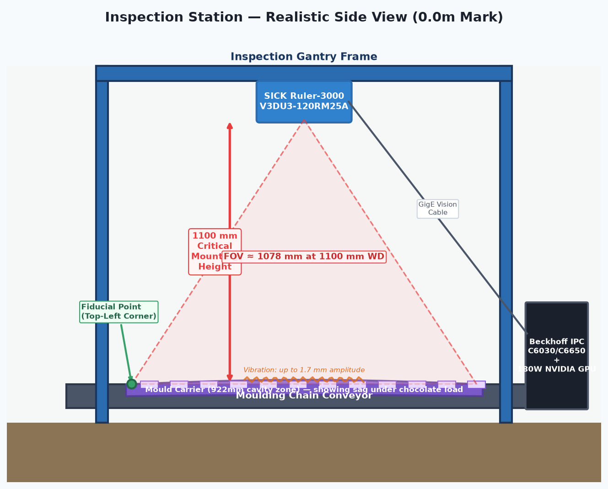

- **Mounting Gantry**: Positioned immediately after wafer deposition and before the biscuit press. The camera gantry spans the 1122 mm mould carrier width.
- **SICK Ruler-3000 Laser Configuration**:
  - **Critical mounting height: 1100 mm** (per Beckhoff handover, Aug 13). This is non-negotiable because the code must see the **full mould width** to locate the top-left corner fiducial point. All cavity measurements are relative to this fiducial.
  - Optical Field of View (FOV) at 1100 mm is approximately **1078 mm**, comfortably covering the **922 mm mould cavity zone** plus edge margin.
  - Acquires 500 profiles per mould at 2912 samples per profile, producing the calibrated 16-bit depth map fed to `ProcessSKU.Process`.
  - **Note:** Earlier documents referenced 770 mm working distance. The 1100 mm requirement supersedes this for full-width fiducial capture.
- **Mould Code Readers**: Two SICK Lector 61 cameras with polarizing filters are mounted on angled brackets at the sides of the conveyor to read the laser-etched 2D DataMatrix code on each mould carrier side. This binds each inspection result to a specific physical mould ID.
- **Synchronization**: An IFM `O6T215` optical proximity sensor detects the leading mechanical edge of the mould carrier to initiate laser profile acquisition. A SICK `DBS60E` incremental encoder mechanically coupled to the conveyor shaft ensures uniform Y-axis profile pitch regardless of slight conveyor speed variations.

---

### 1.5.3 Rejection Station Mechanical Fitment & Multi-SKU Mapping (25.0m)

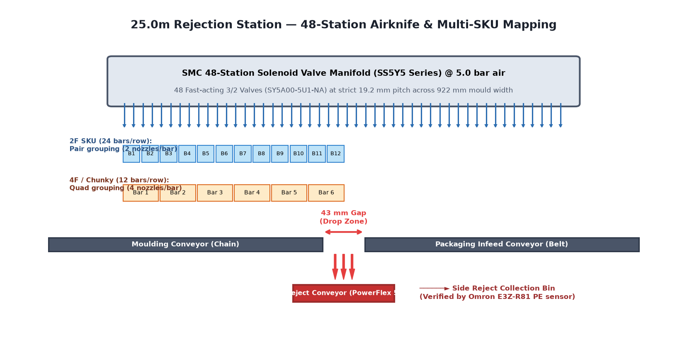

- **43 mm Conveyor Gap**: Located at the transfer point between the moulding conveyor chain and the packaging infeed belt. Acceptable chocolate bars bridge the gap smoothly.
- **SMC 48-Station Airknife Manifold**:
  - Fixed transverse gantry across the 922 mm cavity zone.
  - 48 fast-acting 3/2 solenoid valves (`SY5A00-5U1-NA`) spaced at a strict **19.2 mm pitch** (the width of a single KitKat finger).
  - Dedicated 38-liter air reservoir tank (`VBAT38S1-V`) regulated at 5.0 bar ensures instant pressure without line drops during multi-bar rejection.
- **Multi-SKU Software Pitch Mapping**:
  Because the nozzles are fixed at 19.2 mm, nozzle activation is handled entirely in software based on the active recipe, eliminating mechanical changeovers:
  - **2F SKU (24 bars / row)**: 1 bar = 2 fingers (38.4 mm wide). Software groups nozzles into **pairs** (e.g. Nozzles $\{1,2\}$ for Bar 1, $\{3,4\}$ for Bar 2).
  - **4F / Chunky SKU (12 bars / row)**: 1 bar = 4 fingers (76.8 mm wide). Software groups nozzles into **quads** (e.g. Nozzles $\{1,2,3,4\}$ for Bar 1).
  - **3F SKU (16 bars / row)**: 1 bar = 3 fingers (57.6 mm wide). Software groups nozzles into **triplets** (e.g. Nozzles $\{1,2,3\}$ for Bar 1).
- **Reject Verification**: Blown bars drop through the gap onto the Cobalt `C0B-040-ST` powered reject conveyor (driven by Allen-Bradley PowerFlex 525 VFD) and enter a stainless steel collection bin. An Omron `E3Z-R81` photoelectric retroreflective sensor in the chute confirms that rejected bars physically broke the beam.

---

## 1.6 Beckhoff Handover Meeting — Key Technical Decisions (August 13)

The following decisions and clarifications were made during the code handover call between Beckhoff UK (Chris Knight, Giles Roper, Simon Hall) and Neebal/Faclon. These directly impact how the code must be deployed and maintained.

### 1.6.1 GPU Procurement for C6650 IPC (Phase 2)

| Decision | Detail |
|---|---|
| **Requirement** | Neebal must procure a **180 W NVIDIA GPU** for the Beckhoff C6650 IPC to meet Phase 2 low-latency analysis and rejection timing at Ponda. |
| **Beckhoff Policy** | Beckhoff does **not** bundle third-party GPUs due to liability and 5–10 year support constraints. They will diagnose IPC issues but cannot guarantee the GPU. |
| **Compatibility** | The 180 W card meets the **<300 W** power spec and fits within the **2-PCIe-slot** limit. Installing a compliant GPU does **not** void the IPC warranty. |
| **Acceleration** | Caio (Beckhoff) will ship a spare **C6043 IPC** to Neebal to accelerate development and testing. |
| **Action** | Simon Hall to email formal GPU requirements (power, dimensions, warranty terms) to Neebal. |

### 1.6.2 Critical Mechanical: SICK Ruler Mounting Height = 1100 mm

- **Non-negotiable requirement:** The SICK Ruler-3000 must be mounted at **1100 mm** above the conveyor.
- **Why:** The vision code must see the **full mould width** to locate the **top-left corner fiducial point**. All cavity positions, wafer measurements, and pass/fail decisions are relative to this fiducial.
- **Risk:** If the fiducial cannot be found, the entire measurement logic fails. The 1100 mm height ensures the FOV covers the full 922 mm cavity zone plus edge margin.
- **Action:** Joint review of Phase 1 mechanical drawings is required before cutting metal.

### 1.6.3 Vibration Detection & Delamination Corruption

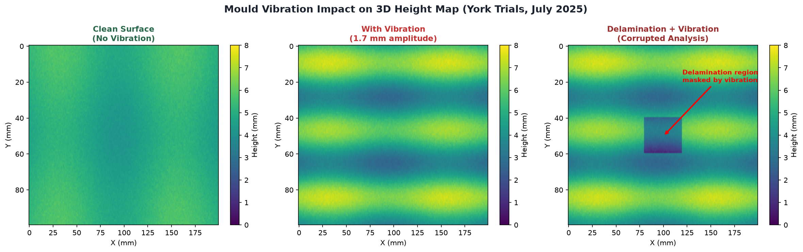

- **Observed issue:** Mould vibration up to **1.7 mm amplitude** was measured during York trials. This appears as horizontal lines in the 3D height map.
- **Impact:** Vibration corrupts **delamination analysis** because the step-change detection (layer removal) is confused by the oscillating surface.
- **Planned feature:** A new vibration detection routine will alert operators via HMI/MES when amplitude exceeds a threshold (initial estimate: ~1/3 of layer height, e.g., ~300 µm for Chunky at 2.5 mm/layer).
- **Stretch goal:** Fourier-space filtering to remove vibration without inducing image artefacts.

### 1.6.4 PackML State Machine

- The system uses **PackML (Packaging Machine Language)** standard for state and mode management.
- **Rationale:** Ensures consistent machine behaviour and simplifies integration with Nestlé's MES. Other Nestlé machines (flow wrappers, multi-packers) already use PackML.
- **Implementation:** Series of function blocks/classes for states (Clearing, Stopped, Starting, Idle, Execute, etc.) and modes (Production, Maintenance, Manual). Invalid transitions are blocked.

### 1.6.5 Recipe Philosophy: Millimetres, Not Pixels

- All recipe dimensions (bar locations, cavity offsets, wafer positions) are stored in **millimetres**, not pixels.
- **Rationale:** Enables portability across machines with different cameras, resolutions, or mounting geometries. A calibration file (pixels per mm) converts recipe values to machine-specific pixel coordinates at runtime.
- **Capacity:** Up to **100 bars** per mould, **10 wafers** per bar = **1000 possible inspection locations**.

### 1.6.6 Fiducial Point & Local Reference Levels

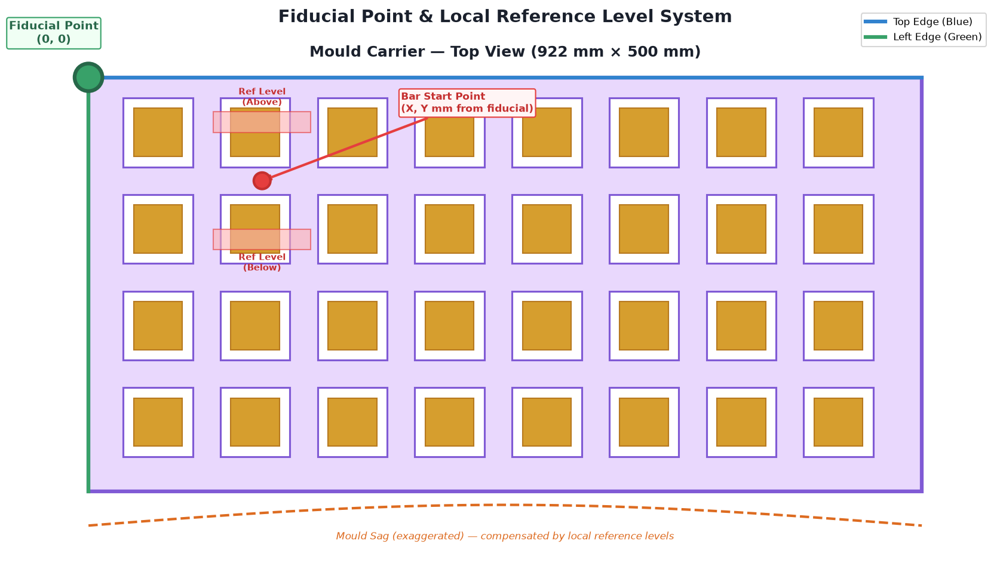

- **Fiducial:** The top-left corner of the mould is located by fitting lines to the top edge (blue) and left edge (green) and computing their intersection.
- **Why:** Compensates for mechanical variation in mould position on the chain.
- **Local reference levels:** For each bar, the code establishes local height references above and below the cavity to compensate for **mould sag** (the mould bows down in the middle under chocolate load).

#### The Bendy Tray Problem (ELI5)

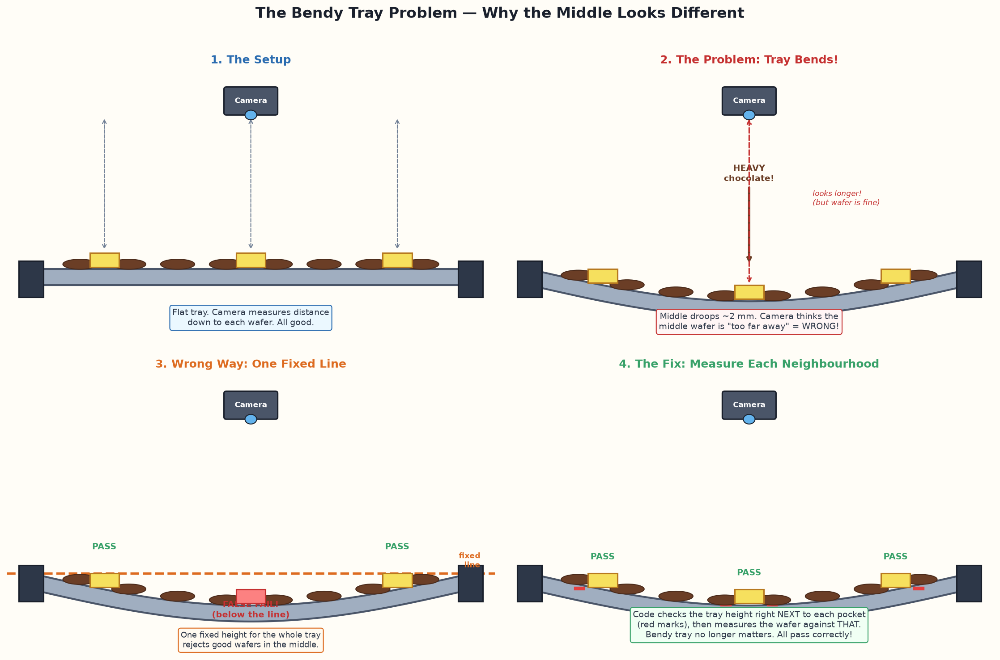

The mould is like a long, thin baking tray. The chain clamps it rigidly at both edges, but the heavy chocolate load makes the **middle bend downward** (like a trampoline with a kid standing on it). Because the camera measures distance from itself, a wafer sitting in the sagging middle looks "too far away" — i.e. the wrong height — even though it is sitting perfectly in its pocket. A single fixed height threshold for the whole mould would therefore **false-reject good wafers in the middle rows** (this is why the middle of the debug images looks different from the sides).

**The fix in `ProcessSKU.Process`:** before measuring each cavity, the code samples the mould surface immediately **above and below** that pocket and measures the wafer relative to *that local level* — like putting a measuring stick right behind each child instead of using one line painted on a sloping floor. The bend is cancelled out cavity-by-cavity.

### 1.6.7 Code Status & Future Changes

- The handed-over code is the **current revision** but **not final**.
- Core architecture (library pyramid, PackML, task split) will not change significantly.
- Internal processes will be extended with new features (vibration detection, enhanced diagnostics, per-cavity image capture).
- Treat the current code as an **illustration of structure**, not the final production version.

---

## 2. Application layer — how the pieces are wired

### 2.1 `MAIN.TcPOU`

```iecst
PROGRAM MAIN
VAR
    EIP_System_Ctrl : SystemControl;
    EIP_System_Ctrl_Byte AT%I* : BYTE;
    DecodeEthernetIPComms : DecodeRockwellData(...);

    EIP_System_Status : SystemStatus;
    EIP_System_Status_Bytes AT%Q* : ARRAY[0..29] OF BYTE;
    EIP_Wafer_Results_Bytes AT%Q* : ARRAY[0..719] OF BYTE;
    EncodeEthernetIPComms : EncodeBeckhoffData(...);

    WaferVisionModule : Wafer_Inspection_Module(
        Name := 'Wafer Detection Module',
        VisionChannel := GVL_Vision.ImageChannel,
        Process := GVL_Vision.WaferDetectionProcess,
        IO_Ctrl := EIP_System_Ctrl,
        IO_Status := EIP_System_Status,
        WaferResultArray := GVL_Vision.WaferProcessResults);
    HMI : Wafer_Module_HMI('Vision Inspection',0,0);
    Init : BOOL;
END_VAR

// Cyclic calls
DecodeEthernetIPComms.CyclicLogic();
WaferVisionModule.CyclicLogic();
HMI.CyclicLogic();
EncodeEthernetIPComms.CyclicLogic();
```

**What it does:**
1. Decodes the Rockwell EtherNet/IP input byte into `SystemControl` (Run/Stop/Reset/Shutdown/HeartBeat).
2. Runs the `Wafer_Inspection_Module` PackML module, which owns the vision channel and process.
3. Encodes `SystemStatus` + the 200-entry `WaferResultStruct` array back to EtherNet/IP outputs for the Rockwell PLC.

### 2.2 `Vision.TcPOU`

```iecst
PROGRAM Vision
// separate program assigned to separate task and run on independent core of IPC
GVL_Vision.ImageChannel.CyclicLogic();
```

Runs the vision acquisition/state machine on its own task/core so image processing does not block the PLC logic task.

### 2.3 `GVL_Vision.TcGVL`

```iecst
VAR_GLOBAL
    Camera : SimpleCamera;
    WaferProcessResults : ARRAY[0..199] OF WaferResultStruct;
    WaferDetectionProcess : ProcessSKU(WaferResultArray := WaferProcessResults);
    ADSImageSource : ImageADSArrayReciever<5242880> := (Height := 2912, Width := 500, ...);
    ImageChannel : VisionChannel(Name := 'Beckhoff Camera', ImageSource := Camera, ImageProcess := WaferDetectionProcess);
END_VAR
```

- `Camera` = SICK Ruler-3000 3D line-scan interface.
- `ProcessSKU` = the vision algorithm (the code you pasted).
- `VisionChannel` = TwinCAT Vision framework channel that feeds images into `ProcessSKU.Process`.
- `WaferProcessResults` = 200-wafer results array passed by reference and later encoded to EIP.

---

## 3. The vision pipeline — `ProcessSKU.Process`

This is the core inspection method. It receives a 16-bit height map (2912 × 500) from the SICK Ruler-3000 and produces a pass/fail result per wafer cavity.

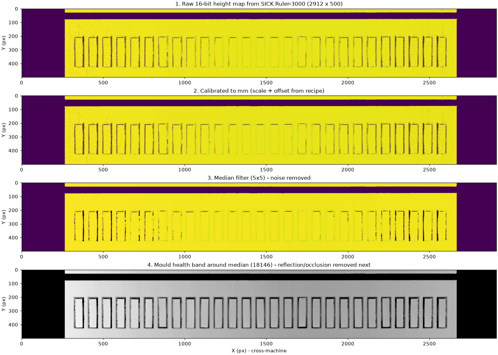

### Stage 0 — Image info & display copy
```iecst
Image.GetImageInfo(ProcessSKUDiagResult.ImageInfo);
hrPrev := F_VN_CopyIntoDisplayableImage(Image, OriginalImage, hrPrev);
```
Captures metadata and keeps an original for display/debug.

### Stage 1 — Calibration
```iecst
hrPrev := F_VN_MultiplyImageWithScalar(Visionrecipe.Pixels.SickRulerScale/VisionRecipe.Pixels.Z_mm, Image, Image, hrPrev);
hrPrev := F_VN_AddScalarToImage(VisionRecipe.Pixels.SickRulerOffset/VisionRecipe.Pixels.Z_mm, Image, Image, hrPrev);
```
Converts raw 16-bit counts to real-world height using the SICK ruler scale/offset and the recipe's `Z_mm` (mm per pixel in Z).

### Stage 2 — Median filter
```iecst
hrPrev := F_VN_MedianFilter(Image, medianFilteredImage, VisionRecipe.VisionProcess.MedianFilterSize, hrPrev);
```
Removes laser speckle/noise. Filter size comes from the recipe (must be odd, max 5).

### Stage 3 — Mould height & health
```iecst
hrPrev := F_VN_CopyImage(medianFilteredImage, workingImage, hrPrev);
hrPrev := F_VN_PyramidDown(workingImage, workingImage, hrPrev);  // x3
ImageMedian_Nestle.Execute(workingImage, hrPrev);
ProcessSKUDiagResult.ImageMedianValue := ImageMedian_Nestle.Median;

ProcessSKUDiagResult.MouldInRange := ImageMedian_Nestle.Median > VisionRecipe.Pixels.MinMouldHeight/ VisionRecipe.Pixels.Z_mm
                                  AND ImageMedian_Nestle.Median < VisionRecipe.Pixels.MaxMouldHeight/ VisionRecipe.Pixels.Z_mm;
```
- Downsamples 3× to speed up the median calculation.
- Checks the whole-image median is inside the expected mould height band.
- Derives `MouldMaxLevel` / `MouldMinLevel` used later to strip reflections and occlusions.

### Stage 4 — Fiducial / mould origin
```iecst
hrPrev := F_VN_LocateEdgeExp(workingImage, ProcessSKUDiagResult.TopEdgePoints, ...);
hrPrev := F_VN_LocateEdgeExp(workingImage, ProcessSKUDiagResult.LeftEdgePoints, ...);
hrPrev := F_VN_FitLine(ProcessSKUDiagResult.TopEdgePoints, ProcessSKUDiagResult.TopLine, hrPrev);
hrPrev := F_VN_FitLine(ProcessSKUDiagResult.LeftEdgePoints, ProcessSKUDiagResult.LeftLine, hrPrev);
hrPrev := F_VN_LineIntersectionPoint(TopLine, LeftLine, LineIntersectionPoint, hrPrev);
hrPrev := F_VN_LineIntersectionPointAndAngle(TopLine, ImageEdgeLine, UnusedIntersection, IntersectionAngle, TRUE, hrPrev);
```
Finds the top and left mould edges, fits lines, and uses their intersection as the **fiducial origin** for all cavity coordinates. The angle vs. the image edge gives mould rotation.

### Stage 5 — Occlusion / reflection removal
```iecst
// reflection: pixels above MouldMaxLevel
hrPrev := F_VN_Threshold(ThresholdImage, ThresholdImage, MouldMaxLevel, MouldMaxLevel, TCVN_TT_BINARY, hrPrev);
hrPrev := F_VN_Threshold(ThresholdInvImage, ThresholdInvImage, MouldMaxLevel, 1.0, TCVN_TT_BINARY_INV, hrPrev);
hrPrev := F_VN_MultiplyImages(workingImage, ThresholdInvImage, workingImage, hrPrev);
hrPrev := F_VN_AddImages(ThresholdImage, workingImage, workingImage, hrPrev);

// occlusion: pixels below MouldMinLevel
hrPrev := F_VN_Threshold(ThresholdInvImage, ThresholdInvImage, MouldMinLevel, MouldMinLevel, TCVN_TT_BINARY_INV, hrPrev);
hrPrev := F_VN_Threshold(ThresholdImage, ThresholdImage, MouldMinLevel, 1.0, TCVN_TT_BINARY, hrPrev);
hrPrev := F_VN_MultiplyImages(workingImage, ThresholdImage, workingImage, hrPrev);
hrPrev := F_VN_AddImages(ThresholdInvImage, workingImage, workingImage, hrPrev);
```
Clamps out-of-band pixels (specular reflection from chocolate, or occluded/shadowed areas) back into the valid mould band. Computes `%Reflection` and `%Occlusion` and checks them against recipe limits.

### Stage 6 — Per-wafer inspection loop
Iterates `Row × Column × Cavity` using the SKU recipe (`NumberOfBars`, `NumberBarsPerRow`, `WafersPerBar`, `BarLocations`, `CavitesOffsets`).

For each wafer:

1. **Reference levels** — copies an extended cavity region, extracts two level-reference strips, and averages their medians to get `BottomMouldLevel`.
2. **Fill / plugged cavity** — thresholds the cavity between `LowThresholdLevel` and `HighTresholdLevel` (derived from `EmptyCavityDepth` + `Min/MaxWaferHeightFromBase`). Pixel count in the band gives `PercentageWaferInCavity`; pixels above `PluggedThresholdLevel` indicate a plugged cavity.
3. **Dimensions & angle** — blob detection finds the wafer outline; edge detection measures width/length; line-fit gives angle.
4. **Delamination** — inside a central stats region, steps down from the max pixel value in `WaferLaminationHeight` increments and measures the % area in each layer.
5. **Height stats** — mean and standard deviation of the wafer height map.

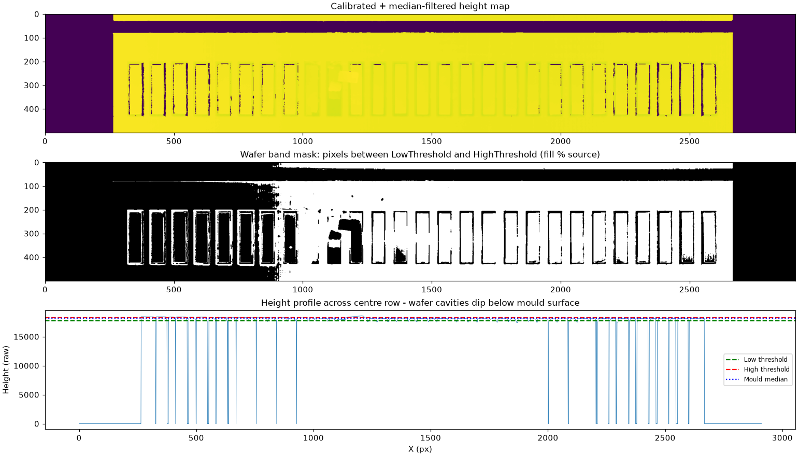

### Stage 7 — Pass/fail decision
```iecst
WaferResults[CurrentWaferIndex].WaferStatus :=
    ProcessWaferResults[CurrentWaferIndex].WaferPercentageOK
    AND ProcessWaferResults[CurrentWaferIndex].WaferHeightOK
    AND ProcessWaferResults[CurrentWaferIndex].WaferDelamOk
    AND ProcessWaferResults[CurrentWaferIndex].WaferDimensionsOk;
```

A wafer passes only if **all four** checks pass.

### Stage 8 — Display image
Draws green (pass) or red (fail) rectangles around each cavity on an 8-bit RGB image for the vision HMI.

### Stage 9 — Cleanup
```iecst
FW_SafeRelease(ADR(workingImage));
FW_SafeRelease(ADR(CorrectedImage));
...
```
Releases TwinCAT Vision image references to prevent memory leaks.

---

## 4. Key data structures

### `WaferResultStruct` (sent to Rockwell)
```iecst
TYPE WaferResultStruct :
STRUCT
    WaferNumberInMould : USINT;
    RowNumber : USINT;
    ColumnNumber : USINT;
    WaferNumberInBar : USINT;
    WaferStatus : BOOL;
    WaferWidth : REAL;
    WaferLength : REAL;
    PercentageWaferInCavity : REAL;
    WaferAngleInDegrees : REAL;
    SDWaferHeight : REAL;
    MeanWaferHeight : REAL;
    WaferCavityOffset : CoOrd_Real;
    PluggedCavity : BOOL;
    WaferLaminatePercentages : ARRAY[0..3] OF LREAL;
END_STRUCT
END_TYPE
```

### `SystemControl` (from Rockwell)
```iecst
TYPE SystemControl :
STRUCT
    Run : BOOL;
    Stop : BOOL;
    Reset : BOOL;
    Shutdown : BOOL;
    HeartBeat : BOOL;
END_STRUCT
END_TYPE
```

### `SystemStatus` (to Rockwell)
```iecst
TYPE SystemStatus :
STRUCT
    CurrentSKUName : STRING(20);
    CurrentSKUID : UINT;
    TotalWafers : USINT;
    TotalBars : USINT;
    TotalRows : USINT;
    InspectionCount : UDINT;
    SystemReady : BOOL;
    SystemRunning : BOOL;
    SystemWarning : BOOL;
    SystemFault : BOOL;
    PowerFailureShutdown : BOOL;
    HeartBeat : BOOL;
END_STRUCT
END_TYPE
```

---

## 5. Code review findings

Ordered by severity.

### Critical

1. **Pass/fail law does not match Ponda URS 4.2.**
   - Current code uses a York-style height-band + area-% + delamination model.
   - URS 4.2 requires: **full bar with all layers = PASS**, **80% bar with all layers = PASS**, **full bar with one layer missing = PASS**, everything else FAIL.
   - The existing `WaferStatus` logic can fail a one-layer-missing bar and can pass/fail on area-% rather than the URS 80% length rule.
   - **Action:** rewrite the decision block to implement URS 4.2 explicitly (see `DELTA_COMPARISON.md`).

2. **No explicit "sticker" (double wafer) detection.**
   - The manual (§5.4) says correct thresholds should detect stickers, but the code only checks `MeanWaferHeight` against min/max limits. A double wafer may still fall inside a wide band.
   - **Action:** add a dedicated max-height / layer-count check for stickers.

### High

3. **Cavity interpolation is recipe-driven, not contour-driven.**
   - The manual (§5.5, §7.6.1) describes contour detection with interpolation if a cavity is not found. The Beckhoff code uses fixed recipe offsets (`BarLocations`, `CavitesOffsets`) from the fiducial; it does not detect cavity contours and interpolate missing ones.
   - **Risk:** if a cavity edge is dirty or the mould is slightly misaligned, the ROI may be off and produce false fails.
   - **Action:** add contour/interpolation fallback or validate fiducial quality before inspection.

4. **No SKU-based geometry switching in the vision code.**
   - The loop uses `VisionRecipe.SKU.NumberOfBars`, `NumberBarsPerRow`, `WafersPerBar`, etc., but there is no evidence of dynamic recipe switching from a digital input as required by URS 4.1/4.3.
   - **Action:** implement SKU recipe load triggered by the line HMI/PLC.

5. **Nozzle mask / rejection mapping is not in this codebase.**
   - The code produces `WaferStatus` per cavity, but the 48-bit nozzle mask, SKU grouping (pairs/triplets/quads), and shift-register tracking are not present. They must be added in the PLC or IPC layer.

### Medium

6. **Hard-coded array sizes.**
   - `WaferProcessResults : ARRAY[0..199]` and `EIP_Wafer_Results_Bytes : ARRAY[0..719]` assume ≤200 wafers. Ponda SKUs use 48 fingers/row × multiple rows; verify the array is large enough for the worst-case mould.

7. **Magic numbers in edge detection.**
   - `F_VN_MeasureEdgeDistanceExp` uses hard-coded `128.0`, `20`, `11.0`, etc. These should be recipe parameters for different SKUs/lighting.

8. **Timing/profiling FBs are called but not exposed.**
   - `TotalTiming`, `ScaleTiming`, `medianTiming`, etc. are toggled but their values are not obviously published to the HMI or logs. Useful for commissioning but currently invisible.

9. **Error handling is minimal.**
   - Most `F_VN_*` calls check `hrPrev` only at the end. A mid-pipeline failure can leave partially computed results.
   - `IF hrPrev <> 0 THEN hrPrev := 0; END_IF` silently swallows errors.

### Low

10. **Typos / naming.**
    - `CavitesOffsets` (should be `CavitiesOffsets`), `HighTresholdLevel` (should be `HighThresholdLevel`), `recieved`, `seperate`, `trhough`. Cosmetic but should be cleaned before handover.

11. **No unit tests.**
    - The README mentions the SPT testing framework, but no tests are present in the repo.

---

## 6. Cross-reference with York manual

| Manual section | What it describes | Where it maps in code |
|---|---|---|
| §2.1 Overview | 3D camera detects wafers before chocolate backing | `ProcessSKU.Process` |
| §2.4 Inspection station | SICK Ruler 3D camera + code readers + trigger | `SimpleCamera` + `VisionChannel` |
| §5.4 Engineering Values | Camera height calibration, wafer thickness thresholds, rejection threshold | `VisionRecipe.Pixels.*`, `VisionRecipe.Wafer.Min/MaxWaferHeightFromBase`, `PassingWaferCavityPercentage` |
| §5.5 Engineering Live View | Acquire → threshold → contour → cavity analysis | Stages 1–6 above |
| §7.6 Vision troubleshooting | Debug image save, SICK Stream Setup | Not in this TwinCAT code; handled by external Peacock script |
| §2.8 Tracking | Mould QR tracking to rejection | Not in this codebase (PLC/Maxtron scope) |

**Important:** the manual describes a **Peacock/York** system with an external acquisition script and a separate vision HMI. The Beckhoff code is a **re-implementation** of the same concept inside TwinCAT, using TwinCAT Vision (`Tc3_Vision`) instead of the external script.

---

## 7. What this means for Faclon

- The Beckhoff code is a solid **classical-CV baseline**: calibration, filtering, fiducial, thresholding, blob/edge metrology, delamination layers.
- It is **not yet Ponda-compliant**: the pass/fail law, SKU handling, nozzle mapping, and tracking must be changed/added.
- The library split means Faclon should treat `ProcessSKU` as the patch point and keep the surrounding PackML/EIP framework unchanged where possible.
